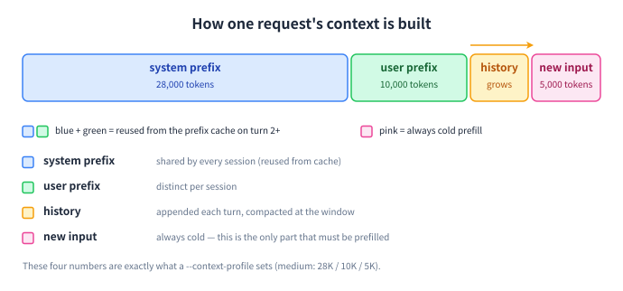
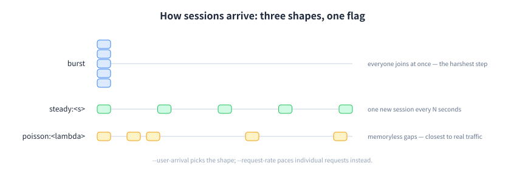

# The knobs you will actually touch

Everything else — all parameters, their defaults and accepted values — is in the [reference](reference.en.md#params), generated from `clawperf --help`.

## Context profiles

A profile sets the shared system prefix, the per-user prefix and the per-turn input at once, so you do not have to invent token counts. Names are case-insensitive.

| Profile | system prefix | user prefix | input / turn | base context | rounded |
|---|---|---|---|---|---|
| `fresh` | 4,000 | 1,500 | 1,500 | **7,000** | ~7K |
| `short` | 14,000 | 5,000 | 3,000 | **22,000** | ~22K |
| `medium` | 28,000 | 10,000 | 5,000 | **43,000** | ~43K |
| `long` | 50,000 | 18,000 | 7,000 | **75,000** | ~75K |
| `full` | 72,000 | 25,000 | 8,000 | **105,000** | ~105K |
| `xl` | 150,000 | 45,000 | 10,000 | **205,000** | ~205K |
| `xxl` | 300,000 | 80,000 | 12,000 | **392,000** | ~392K |



!!! note

    Raw counts still work: `--system-prefix-tokens`, `--user-prefix-tokens`, `--input-tokens-per-turn`. A profile simply overrides all three.

## Suites

A suite runs several (users × profile) scenarios in sequence and writes one result file per scenario. `--model-context-length` skips profiles that cannot fit the model window.

| Suite | users | profiles | turns | out/turn | runs |
|---|---|---|---|---|---|
| `quick` | 1, 4, 8 | `fresh` | 10 | 256 | 3 |
| `standard` | 1, 8, 16, 32 | `medium` + `long` | 20 | 512 | 8 |
| `full` | 1, 4, 8, 16, 32, 64 | `fresh` → `short` → `medium` → `long` → `full` | 30 | 512 | 30 |
| `hitrate` | 1 | `fresh` → `short` → `medium` → `long` → `full` | 5 | 128 | 5 |

```bash title="bash"
clawperf --mode scenario --context-profile medium --num-users 8 ...

# sweep profiles x users
clawperf --mode scenario --suite full --model-context-length 32768 ...
```

## Pacing & concurrency

Four knobs that are easy to confuse. The distinction that matters: a closed loop can never overload a server, an open loop can.

| Knob | Controls | Semantics |
|---|---|---|
| `--user-arrival` | when each **session** joins | users then run their turns back-to-back |
| `--concurrency` | **closed loop**: in-flight request cap | the next request starts when one finishes — the server throttles the load |
| `--request-rate` | **open loop**: issue rate in req/s | released on a Poisson schedule regardless of completions — this one **can** overload a server |
| `--trace-users` | session-level concurrency for trace replay | turns inside one session stay ordered |



## Metrics endpoints

PD-disaggregated and multi-replica services expose one `/metrics` per instance. Pass them all: counters are summed into a fleet-wide view, ratio gauges averaged, and the per-engine table gains one row per instance.

```bash title="bash"
clawperf --mode scenario \
  --endpoint http://lb:9000/v1 --model Qwen3-0.6B \
  --tokenizer /mnt/model/Qwen3-0.6B \
  --metrics-endpoint prefill=http://10.0.0.1:9101/metrics \
  --metrics-endpoint decode=http://10.0.0.2:9102/metrics \
  --reset-cache
```

!!! tip

    Labels are optional (`name=url`; the default is host:port) and the flag is repeatable or comma-separated. `--reset-cache` resets every instance.

### Per-engine metric table from a live run

A live run: resolved config, pre-flight probe, progress, counters.

```console title="clawperf --mode hitrate --endpoint http://127.0.0.1:18095/v1/chat/completions --model \
    qwen3-0.6b --tokenizer tokenizers/qwen3-0.6b --num-requests 60 --input-len 4096 \
    --output-len 32 --hit-rate 0.7 --prefix-num 2 --concurrency 4 --metrics-endpoint \
    http://127.0.0.1:18095/metrics --reset-cache --output results.json"
  HBM Prefix Cache (per engine)
+----------+--------------+------------+----------+
|   Engine | Query Tokens | Hit Tokens | Hit Rate |
+----------+--------------+------------+----------+
| engine 0 |      299,636 |    209,760 |   70.00% |
|    TOTAL |      299,636 |    209,760 |   70.00% |
+----------+--------------+------------+----------+
  Performance Results
+-------------+----------+----------+----------+----------+----------+----------+----------+----------+----+
|      Metric |      Avg |      Min |      P25 |      P50 |      P75 |      P90 |      P99 |      Max |  N |
+-------------+----------+----------+----------+----------+----------+----------+----------+----------+----+
|        TTFT | 55.27 ms | 27.45 ms | 57.15 ms | 57.81 ms | 58.40 ms | 58.96 ms | 59.55 ms | 59.62 ms | 60 |
| E2E Latency | 59.08 ms | 28.34 ms | 61.06 ms | 61.68 ms | 62.00 ms | 62.80 ms | 63.59 ms | 63.89 ms | 60 |
|        TPOT |  0.12 ms |  0.03 ms |  0.12 ms |  0.12 ms |  0.13 ms |  0.14 ms |  0.15 ms |  0.15 ms | 60 |
+-------------+----------+----------+----------+----------+----------+----------+----------+----------+----+
======================================================================
INFO:clawperf:Results saved to: C:\Users\keriko\AppData\Local\Temp\sample_hitrate.json
```

## Env vars & config file

Precedence: **CLI > environment > YAML (`--config`) > defaults**. Every config field has a `CLAWPERF_*` counterpart, upper-cased. An explicitly passed flag always wins — even when its value equals the default.

| Variable | Equivalent to |
|---|---|
| `CLAWPERF_ENDPOINT` | `--endpoint` |
| `CLAWPERF_MODEL` | `--model` |
| `CLAWPERF_API_KEY` | `--api-key` |
| `CLAWPERF_OUTPUT` | `--output` |
| `CLAWPERF_HISTORY` | `--history` (`''` disables) |
| `CLAWPERF_UPSTREAM_ENDPOINT` | `--upstream-endpoint` |
| `CLAWPERF_TOKENIZER_BACKEND` | `transformers` \| `modelscope` |
| `CLAWPERF_<FIELD>` | any field: `CLAWPERF_NUM_USERS`, `CLAWPERF_CONTEXT_PROFILE`, … |

```yaml title="clawperf.yaml — CLI > env > YAML > defaults"
mode: scenario
endpoint: http://localhost:8000/v1
model: Qwen3-0.6B
tokenizer: /mnt/model/Qwen3-0.6B
context_profile: medium
num_users: 8
max_turns: 20
slo_constraints: ["ttft.p99<=1500", "tpot.avg<=30"]
```

```bash title="bash"
clawperf --config clawperf.yaml --num-users 16
```
