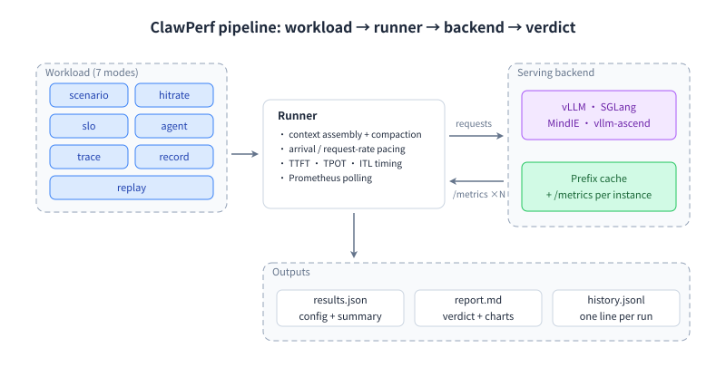

# ClawPerf

面向 **真实 Agent 负载**的 LLM 推理服务性能基准 —— 多轮对话、长上下文、前缀缓存密集的流量。七种模式，一个 CLI，构建在 [EvalScope](https://github.com/modelscope/evalscope) 之上。

- **7 种模式** —— 每种回答一个不同的问题，见下方卡片。
- **4 种后端** —— vLLM · SGLang · MindIE · vllm-ascend，指标映射按后端区分。
- **amd64 + arm64** —— 原生双架构镜像，另带 mock server，CI 无需 GPU。

[快速开始 :material-arrow-right:](quickstart.zh.md){ .md-button .md-button--primary } [完整参考 :material-book-open-variant:](reference.zh.md){ .md-button } [GitHub :fontawesome-brands-github:](https://github.com/ucm-system/ClawPerf){ .md-button }

## 首次运行

默认模式是 `scenario`：N 个用户各自进行不断增长的多轮会话。把 `--tokenizer` 指向本地目录 —— 它会严格离线加载。

```bash title="bash"
clawperf --mode scenario \
  --endpoint http://localhost:8000/v1 --model Qwen3-0.6B \
  --tokenizer /mnt/model/Qwen3-0.6B \
  --context-profile medium --num-users 8 --max-turns 20 \
  --metrics-endpoint http://localhost:8000/metrics \
  --output results.json
```

## 按你要回答的问题选模式

每种模式都会产出 JSON 结果与带结论的 Markdown 报告。每种模式一个页面：为什么做、示意图、命令、参数与一次真实运行。

<div class="grid cards" markdown>

-   :material-account-group:{ .lg .middle } **[scenario](modes/scenario.zh.md)**

    ---

    核心 Agent 负载模拟器

-   :material-database:{ .lg .middle } **[hitrate](modes/hitrate.zh.md)**

    ---

    前缀缓存到底有没有生效？

-   :material-speedometer:{ .lg .middle } **[slo](modes/slo.zh.md)**

    ---

    把时延预算变成容量数字

-   :material-robot:{ .lg .middle } **[agent](modes/agent.zh.md)**

    ---

    让模型真的干活

-   :material-magnify:{ .lg .middle } **[trace](modes/trace.zh.md)**

    ---

    用你自己的流量当负载

-   :material-record-rec:{ .lg .middle } **[record & replay](modes/record-replay.zh.md)**

    ---

    录一次，随处回放

</div>

## 一个 Runner，七种负载



## 实测数据，而非宣传

数据来自 [docs/E2E_TEST_REPORT.md](https://github.com/ucm-system/ClawPerf/blob/main/docs/E2E_TEST_REPORT.md) 的端到端测试：vLLM-Ascend v0.23.0 + Qwen3-0.6B，单张昇腾 910B3。

<div class="grid cards" markdown>

-   :material-check-circle-outline:{ .lg .middle } **命中率可验证**

    ---

    目标 **50.00%**，实测 **49.90%** —— 40 个请求、2 个不同前缀、并发 4。

-   :material-chart-line:{ .lg .middle } **真实 trace 复用率很高**

    ---

    34 个真实 Claude Code 请求的复用上限 **90.42%**；可容纳的请求回放 **29/29** 成功。

-   :material-numeric:{ .lg .middle } **容量是一个确定的数**

    ---

    在 `ttft.p99<=1500ms`、`tpot.avg<=30ms`、`e2e.max<=20s` 下可稳定支撑 **5 个用户**。

</div>

### 一次真机 SLO 扫描

真机 vLLM-Ascend 910B3 SLO 扫描（Qwen3-0.6B，32K 窗口）。

```console title="clawperf report results_e2e/slo.json --print"
Report saved to: results_e2e/slo.md
# ClawPerf Benchmark Report
| Field | Value |
| Model | `qwen3` |
| Endpoint | `http://110.138.0.3:9155/v1` |
| Backend | vllm |
| Mode | `slo` |
| SLO | ttft.p99<=1500ms, tpot.avg<=30ms, e2e.max<=20000ms |
| Max Users | 5 |
| Setup Time | 34.69s |
| Bench Time | 394.06s |
## Verdict: ✅ GOOD
- **Max sustained users:** 5
## Key Findings
- Max sustained users meeting SLO: 5
- SLO criteria: ttft.p99<=1500ms, tpot.avg<=30ms, e2e.max<=20000ms
## Summary
| Users | ttft.p99 | tpot.avg | e2e.max | Error | SLO |
| 1 | 228ms | 9ms | 8888ms | 0.0% | ✅ |
| 2 | 259ms | 9ms | 9090ms | 0.0% | ✅ |
| 4 | 624ms | 15ms | 15.5s | 0.0% | ✅ |
| 5 | 768ms | 15ms | 16.0s | 0.0% | ✅ |
| 6 | 945ms | 21ms | 22.4s | 0.0% | ❌ |
| 8 | 822ms | 25ms | 26.6s | 0.0% | ❌ |
## Methodology
<details>
<summary>Click to expand</summary>
- **TTFT** (Time to First Token): wall time from request send to first content chunk on the wire.
- **TPOT** (Time Per Output Token): decode time / output tokens, excluding prefill.
- **ITL** (Inter-Token Latency): gap between consecutive output chunks.
- **Prefix cache hit rate**: token-level, read from the backend's Prometheus counters (start/end delta). Not
  request-level.
- **Verdict thresholds**: TTFT GOOD ≤3s / OK ≤10s; throughput GOOD ≥30 tok/s / OK ≥15 tok/s.
- **Compaction**: when context exceeds ``max_context_tokens``, history is cleared and the user prefix is incremented.
- **Decode throughput** isolates generation speed from prefill (excludes TTFT).
- **Wall-clock per-user throughput** uses real start/end timestamps, not summed per-request latencies.
</details>
```
