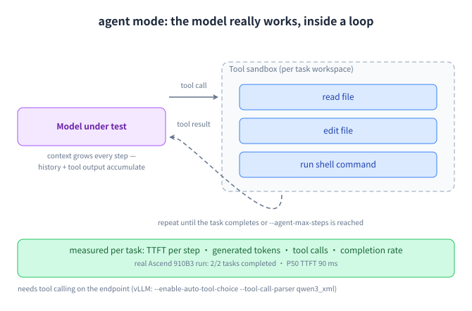

# agent: Let the model actually work

## Why this mode exists

Synthetic prompts are a guess at what agents send. In this mode the model under test really calls functions — reading files, editing them, running shell commands — so the traffic has the shape of agent work: bursty tool loops, long growing histories, and a task that either completes or does not.



## How to run it

```bash title="bash"
clawperf --mode agent \
  --endpoint http://localhost:8000/v1 --model Qwen3-0.6B \
  --tokenizer /mnt/model/Qwen3-0.6B \
  --agent-tasks 8 --agent-max-steps 12 --agent-max-tokens 512 \
  --agent-shell-timeout 30 \
  --output results_agent.json
```

!!! warning

    Needs tool calling on the endpoint. For vLLM that means `--enable-auto-tool-choice --tool-call-parser qwen3_xml` (the parser name depends on the model family).

## Parameters that matter

| Option | What it does |
|---|---|
| `--agent-tasks` | How many coding tasks run concurrently. |
| `--agent-max-steps` | Tool-calling steps allowed per task before it is cut off. |
| `--agent-max-tokens` | Generated tokens per model call inside a task. |
| `--agent-shell-timeout` | Seconds a single shell command may take. |
| `--agent-task-file` | Bring your own tasks instead of the built-in presets. |
| `--agent-workdir` | Base directory for the per-task workspaces. |

The full list, with defaults, is in the [reference](../reference.en.md#params).

## Real output

Real tool-calling agent run.

```console title="clawperf report results_e2e/agent.json --print"
Report saved to: results_e2e/agent.md
# ClawPerf Benchmark Report
| Field | Value |
| Model | `qwen3` |
| Endpoint | `http://110.138.0.3:9155/v1` |
| Backend | vllm |
| Mode | `agent` |
| Tasks | 2 |
| Max Steps | 8 |
| Setup Time | 0.08s |
| Bench Time | 16.05s |
## Verdict: ✅ GOOD
- **TTFT (P50):** 90ms — instant (GOOD)
- **Task completion:** 100%
## Key Findings
- Task completion rate: 100% (2/2)
- P50 TTFT: 90ms — instant
## Summary
| Task | Steps | Finished | Wall(s) | In Tok | Out Tok |
| 0 | 8 | yes | 16.00 | 9,663 | 1,497 |
| 1 | 2 | yes | 4.87 | 1,130 | 479 |
## Methodology
<details>
<summary>Click to expand</summary>
- **TTFT** (Time to First Token): wall time from request send to first content chunk on the wire.
- **TPOT** (Time Per Output Token): decode time / output tokens, excluding prefill.
- **ITL** (Inter-Token Latency): gap between consecutive output chunks.
- **Prefix cache hit rate**: token-level, read from the backend's Prometheus counters (start/end delta). Not
  request-level.
- **Verdict thresholds**: TTFT GOOD ≤3s / OK ≤10s; throughput GOOD ≥30 tok/s / OK ≥15 tok/s.
- **Compaction**: when context exceeds ``max_context_tokens``, history is cleared and the user prefix is incremented.
- **Decode throughput** isolates generation speed from prefill (excludes TTFT).
- **Wall-clock per-user throughput** uses real start/end timestamps, not summed per-request latencies.
</details>
```

## How to read it

- **Task completion** is the first thing to read: a fast run that never finishes the task is not a fast server.
- **Steps and tokens per task** are the real cost of agent work — they decide your token budget, not the prompt length.
- **TTFT per step** shows whether tool-loop latency is dominated by the server or by the tools.

---

**Other modes:** [scenario](scenario.en.md) · [hitrate](hitrate.en.md) · [slo](slo.en.md) · [trace](trace.en.md) · [record & replay](record-replay.en.md)
