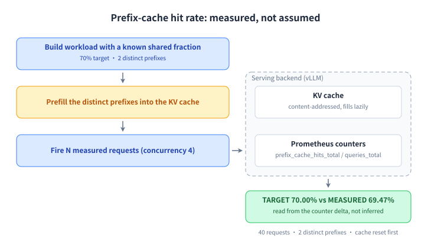

# hitrate: Is the prefix cache actually working?

## Why this mode exists

Prefix caching is the single biggest lever on agent latency, and it is usually assumed rather than measured. This mode builds a workload with a **known** shared fraction, prefills it, then reads the real hit rate out of the server's own Prometheus counters — so “we enabled prefix caching” becomes a number you can put in a review.



## How to run it

```bash title="bash"
clawperf --mode hitrate \
  --endpoint http://localhost:8000/v1 --model Qwen3-0.6B \
  --tokenizer /mnt/model/Qwen3-0.6B \
  --num-requests 200 --input-len 8192 --hit-rate 0.7 --prefix-num 4 \
  --output-len 128 --concurrency 8 \
  --metrics-endpoint http://localhost:8000/metrics --reset-cache \
  --output results_hitrate.json
```

## Parameters that matter

| Option | What it does |
|---|---|
| `--hit-rate` | Target shared fraction 0..1; derives the prefix length. Mutually exclusive with `--prefix-len`. |
| `--input-len` | Total prompt length = shared prefix + boundary + unique suffix. |
| `--prefix-num` | How many *distinct* prefixes are in play — this is what makes it multi-tenant. |
| `--num-requests` | Measure-phase request count. |
| `--no-prefill` | Skip the prefill phase to measure cold-cache behaviour. |
| `--reset-cache` | Evict the cache first so residual traffic does not inflate the result. |

The full list, with defaults, is in the [reference](../reference.en.md#params).

## Real output

Real prefix-cache hit-rate measurement.

```console title="clawperf report results_e2e/hitrate.json --print"
Report saved to: results_e2e/hitrate.md
# ClawPerf Benchmark Report
| Field | Value |
| Model | `qwen3` |
| Endpoint | `http://110.138.0.3:9155/v1` |
| Backend | vllm |
| Mode | `hitrate` |
| Input Len | 4096 |
| Prefix Len | 2048 |
| Concurrency | 4 |
| Setup Time | 10.09s |
| Bench Time | 5.19s |
## Verdict: ✅ GOOD
- **TTFT (P50):** 214ms — instant (GOOD)
- **Measured hit rate:** 49.90% (target: 50.00%)
## Key Findings
- Target hit rate: 50.0%  |  Measured: 49.9%
- P50 TTFT: 214ms — instant
## Summary
| Metric | Value |
| Requests | 40 |
| Success | 40 |
| Errors | 0 |
| Target Hit Rate | 50.0% |
| Measured Hit Rate | 49.90%
| ttft P50 | 214ms |
| e2e_latency P50 | 482ms |
| tpot P50 | 9ms |
## Methodology
<details>
<summary>Click to expand</summary>
- **TTFT** (Time to First Token): wall time from request send to first content chunk on the wire.
- **TPOT** (Time Per Output Token): decode time / output tokens, excluding prefill.
- **ITL** (Inter-Token Latency): gap between consecutive output chunks.
- **Prefix cache hit rate**: token-level, read from the backend's Prometheus counters (start/end delta). Not
  request-level.
- **Verdict thresholds**: TTFT GOOD ≤3s / OK ≤10s; throughput GOOD ≥30 tok/s / OK ≥15 tok/s.
- **Compaction**: when context exceeds ``max_context_tokens``, history is cleared and the user prefix is incremented.
- **Decode throughput** isolates generation speed from prefill (excludes TTFT).
- **Wall-clock per-user throughput** uses real start/end timestamps, not summed per-request latencies.
</details>
```

The hit-rate mode end to end.

```console title="clawperf --mode hitrate --endpoint http://127.0.0.1:18095/v1/chat/completions --model \
    qwen3-0.6b --tokenizer tokenizers/qwen3-0.6b --num-requests 60 --input-len 4096 \
    --output-len 32 --hit-rate 0.7 --prefix-num 2 --concurrency 4 --metrics-endpoint \
    http://127.0.0.1:18095/metrics --reset-cache --output results.json"
======================================================================
ClawPerf - LLM Serving Performance Benchmark
  (Powered by EvalScope perf infrastructure)
======================================================================
  Model:        qwen3-0.6b
  Endpoint:     http://127.0.0.1:18095/v1/chat/completions
  Backend:      vllm
  Users:        1 (arrival: burst)
  Max Turns:    100
  Context:      sys=15000, usr=5000, in=5000, out=1000
  Max Context:  128000 tokens
  Ignore EOS:   True
  Tokenizer:    D:\Project\ClawPerf\tokenizers\qwen3-0.6b
  Metrics:      http://127.0.0.1:18095/metrics
  History:      clawperf_history.jsonl (append)
======================================================================
INFO:clawperf:Loaded local tokenizer from D:\Project\ClawPerf\tokenizers\qwen3-0.6b [local dir (transformers)] —
  vocab=151669, chat_template=yes
INFO:clawperf:Pre-flight check: probing http://127.0.0.1:18095/v1/chat/completions ...
INFO:clawperf:Pre-flight check OK (attempt 1/3).
INFO:clawperf:Hit-rate test: 60 requests, input=4096, prefix=2867 (target 70.0%), 2 distinct prefixes, output=32,
  concurrency=4
WARNING:clawperf:Prefix cache reset endpoint http://127.0.0.1:18095/reset_prefix_cache not found (404) — this backend
  doesn't expose cache reset. Continuing without a clean baseline; measured hit rate may include residual prefixes.
INFO:clawperf:Setup complete in 11.22s — starting hit-rate test
INFO:clawperf:Prefill: injecting 2 distinct prefixes ...
INFO:clawperf:Metrics start (post-prefill): query=191,842 hit=141,439 ext_query=15,655 ext_hit=0 engines=['0']
  ext_engines=['0']
INFO:clawperf:Measure: sending 60 requests ...
HitRate: 100%|██████████| 60/60 [00:00<00:00, 66.44req/s]
INFO:clawperf:Metrics end: query=491,478 hit=351,199 ext_query=15,655 ext_hit=0 engines=['0'] ext_engines=['0']
INFO:clawperf:History appended to: clawperf_history.jsonl
INFO:clawperf:Markdown report saved to: C:\Users\keriko\AppData\Local\Temp\sample_hitrate.md
======================================================================
ClawPerf - Hit-Rate Test Complete
======================================================================
  Hit-Rate Results
+-------------------------+---------------+
| Metric                  |         Value |
+-------------------------+---------------+
| Setup Time              |       11.22 s |
| Duration                |        0.95 s |
| Total Requests          |            60 |
| Success Requests        |            60 |
| Failed Requests         |             0 |
| Input Length            |   4096 tokens |
| Prefix Length           |   2867 tokens |
| Distinct Prefixes       |             2 |
| Output Length           |     32 tokens |
| Concurrency             |             4 |
| Total Input Tokens      |       245,760 |
| Total Output Tokens     |         1,920 |
| Output Token Throughput | 2014.69 tok/s |
| TARGET Hit Rate         |        70.00% |
| MEASURED Hit Rate       |        70.00% |
| HBM Hit Tokens          |       209,760 |
| HBM Query Tokens        |       299,636 |
+-------------------------+---------------+
```

## How to read it

- **TARGET vs MEASURED** is the headline: they should be within a point or two. A large gap means the prompts are not sharing what you think they share.
- **Speedup** is the real payoff — the theoretical ceiling is `1/(1-hit)`, and the report prints both.
- **Per-engine rows** show which instance served the reuse; in PD setups the prefill instance usually carries it.

---

**Other modes:** [scenario](scenario.en.md) · [slo](slo.en.md) · [agent](agent.en.md) · [trace](trace.en.md) · [record & replay](record-replay.en.md)
