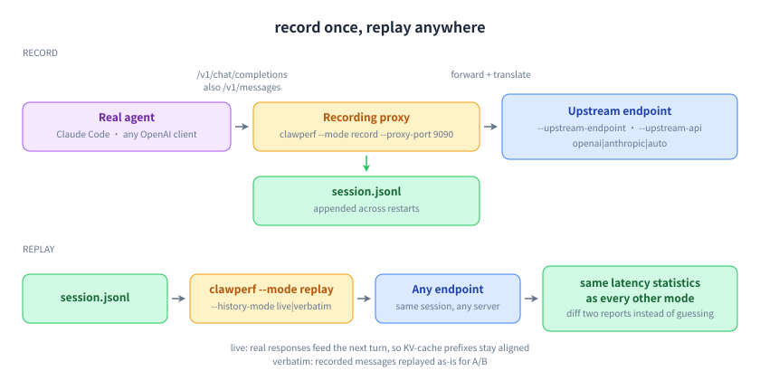

# record & replay: Capture once, replay anywhere

## Why this mode exists

The most convincing benchmark is your own session. Point a real agent (Claude Code, any OpenAI or Anthropic client) at the recording proxy while you work; afterwards you can replay that exact session against any endpoint — before and after a config change, or between two vendors — with the KV-cache prefix aligned the way it was live.



## How to run it

```bash title="bash"
# terminal 1 — record (accepts /v1/chat/completions and /v1/messages)
clawperf --mode record --proxy-port 9090 \
  --upstream-endpoint https://api.example.com/v1 --upstream-api openai \
  --recording session.jsonl
# ... point your agent at http://localhost:9090/v1, work, then Ctrl+C

# terminal 2 — replay it against any endpoint
clawperf --mode replay --recording session.jsonl \
  --endpoint http://localhost:8000/v1 --model Qwen3-0.6B \
  --tokenizer /mnt/model/Qwen3-0.6B \
  --history-mode live --concurrency 4 \
  --output results_replay.json
```

## Parameters that matter

| Option | What it does |
|---|---|
| `--recording` | The JSONL file to write (record) or read (replay). Appends across restarts and tells you what it kept. |
| `--upstream-endpoint` | Where the proxy forwards to. |
| `--upstream-api` | `openai`, `anthropic` or `auto` — Anthropic is translated on the fly. |
| `--history-mode` | `live` feeds real responses into the next turn (prefix-aligned); `verbatim` replays recorded messages as-is for A/B. |
| `--concurrency` | In-flight requests during replay. |

The full list, with defaults, is in the [reference](../reference.en.md#params).

## Real output

A recorded agent session replayed with live history.

```console title="clawperf report results_e2e/replay.json --print"
Report saved to: results_e2e/replay.md
# ClawPerf Benchmark Report
| Field | Value |
| Model | `qwen3` |
| Endpoint | `http://110.138.0.3:9155/v1` |
| Backend | vllm |
| Mode | `replay` |
| Setup Time | 0.00s |
| Bench Time | 93.84s |
## Verdict: ❌ POOR
## Methodology
<details>
<summary>Click to expand</summary>
- **TTFT** (Time to First Token): wall time from request send to first content chunk on the wire.
- **TPOT** (Time Per Output Token): decode time / output tokens, excluding prefill.
- **ITL** (Inter-Token Latency): gap between consecutive output chunks.
- **Prefix cache hit rate**: token-level, read from the backend's Prometheus counters (start/end delta). Not
  request-level.
- **Verdict thresholds**: TTFT GOOD ≤3s / OK ≤10s; throughput GOOD ≥30 tok/s / OK ≥15 tok/s.
- **Compaction**: when context exceeds ``max_context_tokens``, history is cleared and the user prefix is incremented.
- **Decode throughput** isolates generation speed from prefill (excludes TTFT).
- **Wall-clock per-user throughput** uses real start/end timestamps, not summed per-request latencies.
</details>
```

## How to read it

- **live** is what you want for capacity work: the server's own responses become the next turn's history, so the prefixes line up exactly as they did in production.
- Use **verbatim** when comparing two servers on identical input — same bytes, different server.
- The verdict uses the same thresholds as every other mode, so two reports diff cleanly.

---

**Other modes:** [scenario](scenario.en.md) · [hitrate](hitrate.en.md) · [slo](slo.en.md) · [agent](agent.en.md) · [trace](trace.en.md)
