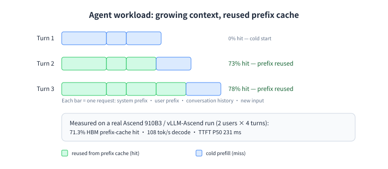

# scenario: 核心 Agent 负载模拟器

## 为什么做这个模式

编码 Agent 不会只发一次请求 —— 它让会话不断增长、每轮复用同一段系统前缀，并且多个会话并发。单次请求压测看不到逐轮累积的预填充量，于是给出一个用户永远拿不到的 TTFT。**这个模式直接对「会话」建模。**



## 怎么用

```bash title="bash"
clawperf --mode scenario \
  --endpoint http://localhost:8000/v1 --model Qwen3-0.6B \
  --tokenizer /mnt/model/Qwen3-0.6B \
  --context-profile medium \
  --num-users 8 --max-turns 20 --user-arrival poisson:2 \
  --metrics-endpoint http://localhost:8000/metrics --reset-cache \
  --output results_scenario.json
```

## 关键参数

| 参数 | 作用 |
|---|---|
| `--context-profile` | 命名的上下文大小：`fresh` 7K → `xxl` 392K，一次性设定系统前缀、用户前缀与每轮输入。 |
| `--num-users` | 并发会话数。 |
| `--max-turns` | 每个会话的轮数；历史在这些轮之间累积。 |
| `--user-arrival` | 会话加入时机：`burst`、`steady:<秒>`、`poisson:<lambda>`。 |
| `--max-context-tokens` | 追加式压缩的触发阈值 —— 设为模型真实窗口。 |
| `--suite` | 一条命令扫完多组（并发 × 档位）。 |

完整参数列表（含默认值）见[完整参考](../reference.zh.md#params)。

## 真实输出

同一台机器上的真实多轮长上下文运行。

```console title="clawperf report results_e2e/scenario.json --print"
Report saved to: results_e2e/scenario.md
# ClawPerf Benchmark Report
| Field | Value |
| Model | `qwen3` |
| Endpoint | `http://110.138.0.3:9155/v1` |
| Backend | vllm |
| Mode | `scenario` |
| Users | 2 |
| Max Turns | 4 |
| Context | sys=4000 + usr=1500 + in=1500 tokens |
| Setup Time | 37.23s |
| Bench Time | 40.33s |
## Verdict: ✅ GOOD
- **TTFT (P50):** 221ms — instant (GOOD)
- **Decode throughput:** 99.5 tok/s — smooth (GOOD)
## Key Findings
- Per-user decode throughput ranges 99.4–99.5 tok/s
- Concurrency efficiency: 50% (max_thru / (min_thru × N))
- P50 TTFT: 221ms — instant
## Summary
| User | In Tok | Out Tok | TTFT P50 | TPOT P50 | E2E P50 | tok/s | Comp | Succ | Fail |
| 0 | 40,589 | 4,000 | 221ms | 9.25ms | 9460ms | 99.5 | 0 | 4 | 0 |
| 1 | 41,313 | 4,000 | 240ms | 9.23ms | 9453ms | 99.4 | 0 | 4 | 0 |
## TTFT Scaling (P50)
```
   1 user(s) | ███████████████████████████░░░ 221ms
   2 user(s) | ██████████████████████████████ 240ms
```
## Concurrency Scaling
| Users | Total tok/s | Per-user tok/s | Efficiency |
| 1 | 99.5 | 99.5 | 100% |
| 2 | 198.8 | 99.4 | 100% |
## Methodology
<details>
<summary>Click to expand</summary>
- **TTFT** (Time to First Token): wall time from request send to first content chunk on the wire.
- **TPOT** (Time Per Output Token): decode time / output tokens, excluding prefill.
- **ITL** (Inter-Token Latency): gap between consecutive output chunks.
- **Prefix cache hit rate**: token-level, read from the backend's Prometheus counters (start/end delta). Not
  request-level.
- **Verdict thresholds**: TTFT GOOD ≤3s / OK ≤10s; throughput GOOD ≥30 tok/s / OK ≥15 tok/s.
- **Compaction**: when context exceeds ``max_context_tokens``, history is cleared and the user prefix is incremented.
- **Decode throughput** isolates generation speed from prefill (excludes TTFT).
- **Wall-clock per-user throughput** uses real start/end timestamps, not summed per-request latencies.
</details>
```

## 怎么读结果

- **TTFT** 应随上下文增长：把最初的几轮和最后的几轮对比。
- **解码吞吐**反映会话变多时批处理是否还撑得住。
- **Compactions** 大于 0 表示某个会话触及窗口、历史被折叠 —— 长跑时属正常，不是错误。
- **失败请求**必须为 0；一旦出现 400，通常是上下文已经放不下了。

---

**其他模式:** [hitrate](hitrate.zh.md) · [slo](slo.zh.md) · [agent](agent.zh.md) · [trace](trace.zh.md) · [record & replay](record-replay.zh.md)
