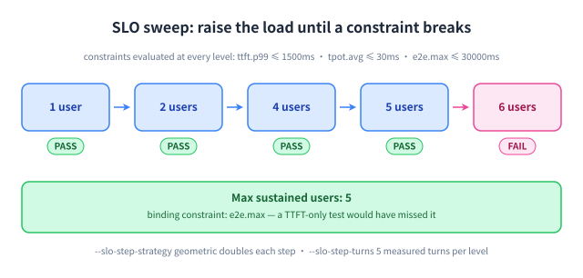

# slo: 把时延预算变成容量数字

## 为什么做这个模式

「这台机器能支撑多少用户」是每个容量规划都要回答的问题，而单个负载档位答不了。这个模式逐级提高并发，在每一级评估**全部**约束，并在第一个被打破的档位停下 —— 并指出是哪条约束先破的。



## 怎么用

```bash title="bash"
clawperf --mode slo \
  --endpoint http://localhost:8000/v1 --model Qwen3-0.6B \
  --tokenizer /mnt/model/Qwen3-0.6B \
  --slo ttft.p99:1500 --slo tpot.avg:30 --slo e2e.max:30000 \
  --slo-min-users 1 --slo-max-users 200 --slo-step-strategy geometric \
  --slo-step-turns 5 --slo-error-rate 0.01 \
  --output results_slo.json
```

## 关键参数

| 参数 | 作用 |
|---|---|
| `--slo` | 可重复的约束 `<指标>.<统计量><分隔符><毫秒>`；多条之间为「与」关系。 |
| `--slo-min-users` | 扫描的起始并发用户数。 |
| `--slo-max-users` | 扫描可达到的最大并发用户数。 |
| `--slo-step-strategy` | `geometric` 每步翻倍；`linear` 逐级递增。 |
| `--slo-step-turns` | 每一级每个用户参与测量的轮数（另有 `--slo-step-warmup-turns` 预热轮）。 |
| `--slo-error-rate` | 额外的错误率达标条件。 |
| `--slo-step-timeout-s` | 每级的墙钟预算；超时记为 TIMEOUT 并判定不达标。 |

完整参数列表（含默认值）见[完整参考](../reference.zh.md#params)。

## 真实输出

真机 vLLM-Ascend 910B3 SLO 扫描（Qwen3-0.6B，32K 窗口）。

```console title="clawperf report results_e2e/slo.json --print"
Report saved to: results_e2e/slo.md
# ClawPerf Benchmark Report
| Field | Value |
| Model | `qwen3` |
| Endpoint | `http://110.138.0.3:9155/v1` |
| Backend | vllm |
| Mode | `slo` |
| SLO | ttft.p99<=1500ms, tpot.avg<=30ms, e2e.max<=20000ms |
| Max Users | 5 |
| Setup Time | 34.69s |
| Bench Time | 394.06s |
## Verdict: ✅ GOOD
- **Max sustained users:** 5
## Key Findings
- Max sustained users meeting SLO: 5
- SLO criteria: ttft.p99<=1500ms, tpot.avg<=30ms, e2e.max<=20000ms
## Summary
| Users | ttft.p99 | tpot.avg | e2e.max | Error | SLO |
| 1 | 228ms | 9ms | 8888ms | 0.0% | ✅ |
| 2 | 259ms | 9ms | 9090ms | 0.0% | ✅ |
| 4 | 624ms | 15ms | 15.5s | 0.0% | ✅ |
| 5 | 768ms | 15ms | 16.0s | 0.0% | ✅ |
| 6 | 945ms | 21ms | 22.4s | 0.0% | ❌ |
| 8 | 822ms | 25ms | 26.6s | 0.0% | ❌ |
## Methodology
<details>
<summary>Click to expand</summary>
- **TTFT** (Time to First Token): wall time from request send to first content chunk on the wire.
- **TPOT** (Time Per Output Token): decode time / output tokens, excluding prefill.
- **ITL** (Inter-Token Latency): gap between consecutive output chunks.
- **Prefix cache hit rate**: token-level, read from the backend's Prometheus counters (start/end delta). Not
  request-level.
- **Verdict thresholds**: TTFT GOOD ≤3s / OK ≤10s; throughput GOOD ≥30 tok/s / OK ≥15 tok/s.
- **Compaction**: when context exceeds ``max_context_tokens``, history is cleared and the user prefix is incremented.
- **Decode throughput** isolates generation speed from prefill (excludes TTFT).
- **Wall-clock per-user throughput** uses real start/end timestamps, not summed per-request latencies.
</details>
```

## 怎么读结果

- **每条约束一列** —— 报告不会隐藏你要求的任何一条约束。
- **最大可支撑用户数**就是要引用的数字；再上一档就是它开始崩的地方。
- 注意*哪一列*变红：容量往往在 TTFT 变差之前很久就被 `e2e.max` 卡住。
- **TIMEOUT** 行表示该档没能在 `--slo-step-timeout-s` 内跑完 —— 超长上下文时可以调大。

---

**其他模式:** [scenario](scenario.zh.md) · [hitrate](hitrate.zh.md) · [agent](agent.zh.md) · [trace](trace.zh.md) · [record & replay](record-replay.zh.md)
