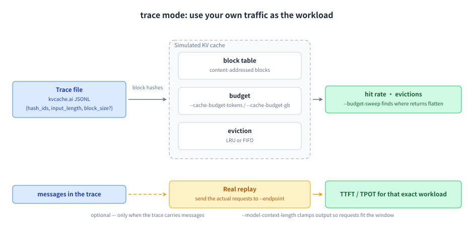

# trace: Use your own traffic as the workload

## Why this mode exists

Every simulated workload is a guess about your traffic; a production trace is not. This mode replays a real trace's block hashes through a simulated cache to measure achievable reuse and the hit-rate-vs-budget curve — no endpoint needed — and can then send the trace's actual requests to your endpoint to measure what that workload really costs.



## How to run it

```bash title="bash"
# simulation only — no endpoint needed
clawperf --mode trace --trace-file trace.jsonl.gz \
  --budget-sweep --eviction-policy lru

# simulation + real replay, clamped to the model window
clawperf --mode trace --trace-file trace.jsonl.gz \
  --endpoint http://localhost:8000/v1 --model Qwen3-0.6B \
  --tokenizer /mnt/model/Qwen3-0.6B \
  --cache-budget-gb 40 --kv-bytes-per-token 2.0 \
  --model-context-length 32768 --trace-users 4 \
  --output results_trace.json
```

## Parameters that matter

| Option | What it does |
|---|---|
| `--trace-file` | kvcache.ai JSONL (`hash_ids`, `input_length`, optional `block_size`), gzipped or plain, or `-` for stdin. |
| `--budget-sweep` | Scan several cache sizes to find where returns flatten. |
| `--cache-budget-tokens` | Fixed budget in tokens. |
| `--cache-budget-gb` | Fixed budget in GB, via `--kv-bytes-per-token`. |
| `--eviction-policy` | `lru` or `fifo`. |
| `--trace-users` | Session-level concurrency when the trace carries user/session ids. |
| `--model-context-length` | Clamps replay output length; requests that cannot fit are skipped with a reason. |

The full list, with defaults, is in the [reference](../reference.en.md#params).

## Real output

KV-cache budget sweep over a real trace.

```console title="clawperf report results_e2e/trace.json --print"
Report saved to: results_e2e/trace.md
# ClawPerf Benchmark Report
| Field | Value |
| Model | `qwen3` |
| Endpoint | `http://110.138.0.3:9155/v1` |
| Backend | vllm |
| Mode | `trace` |
| Requests | 34 |
| Total Tokens | 338,995 |
| Unique Blocks | 523 |
| Policy | lru |
| Setup Time | 0.00s |
| Bench Time | 113.30s |
## Verdict: ✅ GOOD
- **Real replay TTFT (P50):** 111ms — instant (GOOD)
- **Real replay decode:** 101.3 tok/s
## Key Findings
- KV cache hit rate: 90.42%  (ceiling: 90.42%)
- Ideal prefill speedup: 10.44x  (= 1 / (1 - 90.42%))
- Real replay: TTFT P50 111ms, decode 101.3 tok/s
## Summary
| Metric | Value |
| Requests | 34 |
| Total Input Tokens | 338,995 |
| Unique Blocks | 523 |
| Hit Rate | 90.42% |
| Ceiling | 90.42% |
| Speedup | 10.44x |
| Hit Tokens | 276,346 |
| Miss Tokens | 29,281 |
### Real Replay (measured)
| Metric | Value |
| Requests | 29 ok / 34 total |
| Total Input Tokens | 261,897 |
| Total Output Tokens | 14,159 |
| TTFT P50 | 110.98 ms |
| TTFT P95 | 186.62 ms |
| TTFT P99 | 195.54 ms |
| E2E P50 | 3584.75 ms |
| Decode tok/s | 101.29 tok/s |
| ITL P50 | 9.96 ms |
| ITL P95 | 13.91 ms |
## Methodology
<details>
<summary>Click to expand</summary>
- **TTFT** (Time to First Token): wall time from request send to first content chunk on the wire.
- **TPOT** (Time Per Output Token): decode time / output tokens, excluding prefill.
- **ITL** (Inter-Token Latency): gap between consecutive output chunks.
- **Prefix cache hit rate**: token-level, read from the backend's Prometheus counters (start/end delta). Not
  request-level.
- **Verdict thresholds**: TTFT GOOD ≤3s / OK ≤10s; throughput GOOD ≥30 tok/s / OK ≥15 tok/s.
- **Compaction**: when context exceeds ``max_context_tokens``, history is cleared and the user prefix is incremented.
- **Decode throughput** isolates generation speed from prefill (excludes TTFT).
- **Wall-clock per-user throughput** uses real start/end timestamps, not summed per-request latencies.
</details>
```

## How to read it

- **Hit rate vs budget** is the sizing answer: pick the budget just before the curve flattens.
- **Evictions** tell you the cache is thrashing rather than simply too small.
- On real replay, **context overflow** entries are skipped on purpose — they are physical impossibilities, not server failures.

---

**Other modes:** [scenario](scenario.en.md) · [hitrate](hitrate.en.md) · [slo](slo.en.md) · [agent](agent.en.md) · [record & replay](record-replay.en.md)
